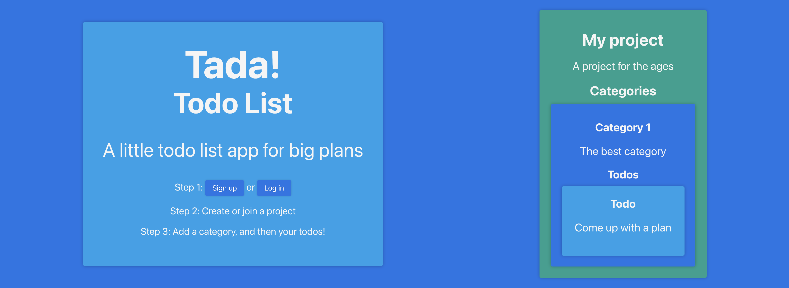

# Tada! Todo list

A draggable, droppable, reorganizable todo list app built with React, Redux, and Ruby on Rails

[Demo](https://tada-todo-list.herokuapp.com/)

## Requirements

- Ruby 2.7.4 with updated `bundler` and `rails`
- NodeJS v14+ with updated `npm`
- PostgreSQL 13

## Installation

First, make sure you have all the environment requirements installed.

### Recommended way to get Ruby 2.7.4 if you're not sure: 
- Install [rvm](https://rvm.io/)
- run `rvm install 2.7.4`
- afterwards, run `gem install bundler` and `gem install rails`

### Recommended way to get NodeJS v14+ if you're not sure:
- Install [nvm](https://github.com/nvm-sh/nvm)
- run `nvm install node`
- afterwards, run `npm install -g npm`

### Recommended way to get PostgreSQL 13 if you're not sure: 
- MacOS:
  - Install [Homebrew](https://brew.sh/)
  - run `brew install postgresql`
  - afterwards, run `brew services start postgresql`
- Other system instructions coming soon

### After the environment is set up, clone this repo and navigate to its root directory, then run:
- `bundle install`
- `rails db:setup`
- `npm install --prefix client`

## Running the app

Simply run `rails start` to launch the backend and frontend together. This command will also open the frontend in your browser.

## Usage
- Create a new user account (usernames and emails must be unique, and passwords must be at least 8 characters)
- Navigate to the Projects page and create a project using the button at the top of the page
- Create a category for your new project, then at least one todo
- Projects made public can be joined from the home page by other users of the app for collaboration

### Things to keep in mind:
- Emails are not verified in any way right now, so feel free to sign up at the demo page using a throwaway account to test it out
- Remember that you can have multiple projects, toods and categories at once
- Categories and todos can be dragged and dropped between their containers to reorganize them
- If the Projects page is too busy or not useful, you can see just your Categories, or focus on just your Todos, at their respective pages as well
- You can leave projects that you have joined easily, and afterwards you can rejoin them at any time
- You can't leave your own project if you're the one who created it, but you can delete it (it will no longer be available to any user who has joined)
- Changes made are automatically saved to the database, no need to manually save
- User sessions last 30 minutes (for security purposes), after which you will need to login again
- User accounts cannot currently be deleted

## Development

By default, the both the Rails backend and the React frontend run in development mode. 

The backend serves at `localhost:3000` by default. Many routes are under a prefix, `localhost:3000/api`.

The frontend serves at `localhost:4000` by default. Clientside routing is in use via `react-router-dom`. 

Both the frontend and backend have fallback routes setup, so that requests which do not have a route defined will work properly in production mode.

### Production

Please change the file `client/src/constants/urls.js` according to your production environment prior to usage should you choose to try running this app in production mode whether or not you have made any other modifications.

Also, please remove the attribution in the footer component of the frontend first as well if you are going to make your version of the app publicly available.   

This component can be found in the file `client/src/components/Footer.js`.

### Contributing

Bug reports and pull requests are welcome on GitHub at https://github.com/ghemsley/project-template-react-rails-api

## License

The project scaffold this app is built upon is licensed under the Learn.co Educational Content License, where applicable.

All changes upon that scaffold are Copyright (c) 2021 Graham Hemsley and made available under the MIT license, where applicable.

For the text of these licenses, please see the included [LICENSE file](./LICENSE.md).
